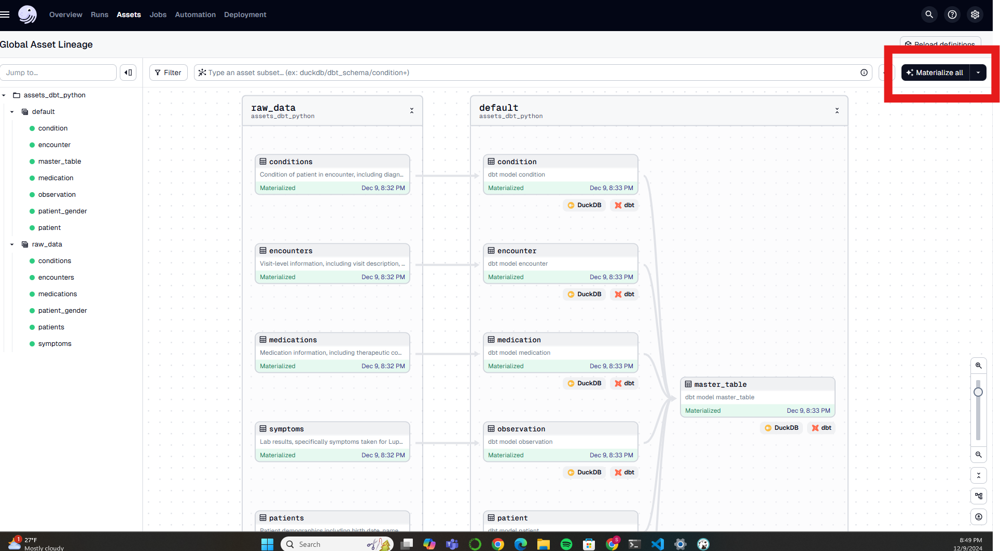

# century-health-project

To run the pipeline, do the following.
1. Create and activate a python environment (uv is my reccomended).
2. install the requirements.txt file (uv pip install -r requirements.txt)
3. Place the data sources in the data/ folder
4. In the terminal, run "dagster dev"
5. Open [localhost](http://127.0.0.1:3000) for the dagster UI
6. Click on Assets >> View global asset lineage.
7. In the right click Materialize all. 
